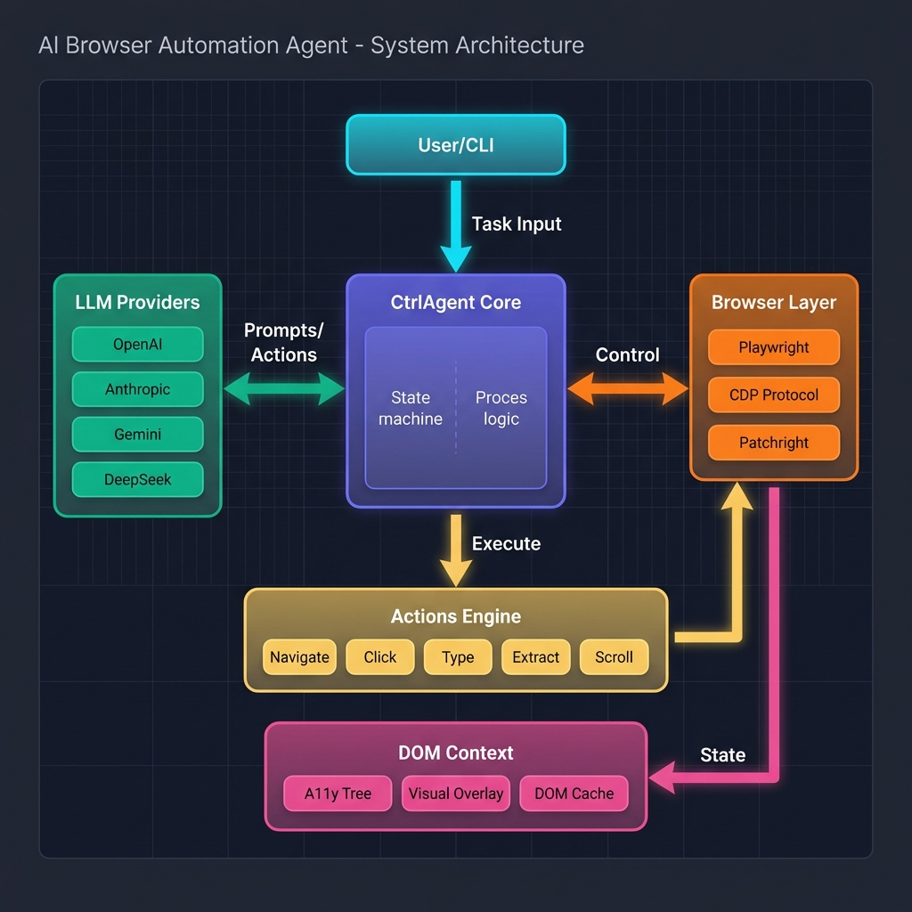
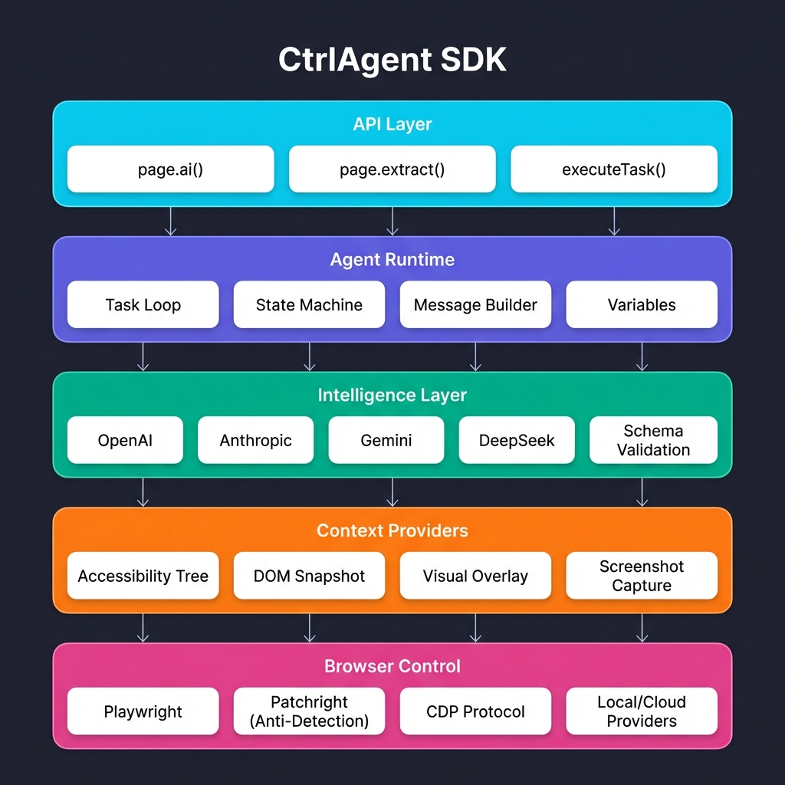
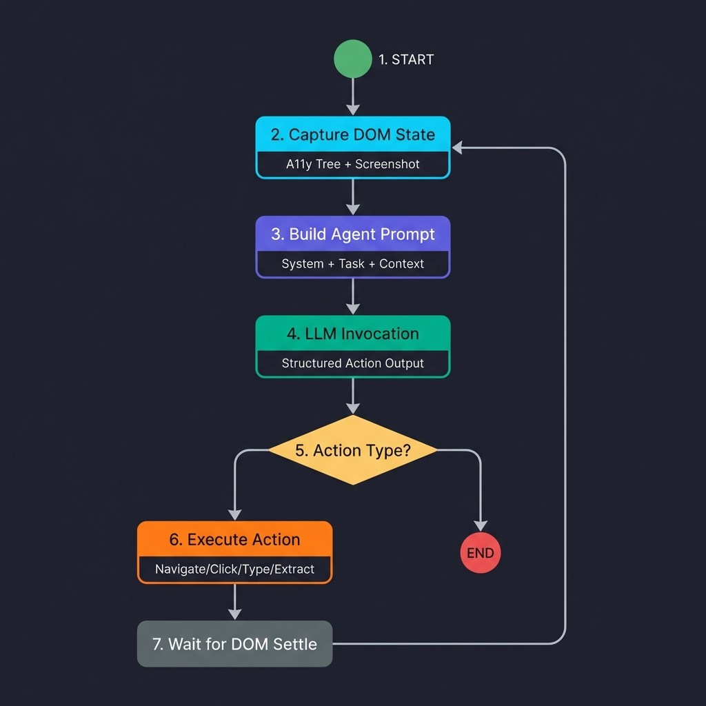

# CtrlAgent

**Advanced AI-Powered Browser Automation SDK**

CtrlAgent is a sophisticated browser automation framework that leverages Large Language Models (LLMs) to execute complex web tasks through natural language instructions. The system provides both imperative page methods and a programmatic task execution API, enabling developers to automate browser interactions without writing explicit selectors or navigation logic.

---

## Table of Contents

- [Overview](#overview)
- [System Architecture](#system-architecture)
- [Core Components](#core-components)
- [Execution Flow](#execution-flow)
- [Installation](#installation)
- [Quick Start](#quick-start)
- [API Reference](#api-reference)
- [LLM Providers](#llm-providers)
- [Browser Providers](#browser-providers)
- [Action System](#action-system)
- [DOM Context Extraction](#dom-context-extraction)
- [MCP Integration](#mcp-integration)
- [Configuration](#configuration)
- [Debug Mode](#debug-mode)
- [Project Structure](#project-structure)
- [Contributing](#contributing)
- [License](#license)

---

## Overview

CtrlAgent transforms natural language instructions into precise browser actions through an agentic loop architecture. The system captures the current page state using accessibility trees and visual overlays, constructs prompts for LLM reasoning, and executes the resulting actions through Playwright or direct Chrome DevTools Protocol (CDP) calls.

### Key Capabilities

- **Natural Language Control**: Execute browser tasks using plain English instructions
- **Autonomous Navigation**: Let the AI agent determine the optimal path to complete complex tasks
- **Structured Data Extraction**: Extract typed data from web pages with schema validation
- **Multi-Provider LLM Support**: Compatible with OpenAI, Anthropic, Google Gemini, and DeepSeek
- **Anti-Detection**: Built-in stealth features through Patchright integration
- **MCP Integration**: Extensible through Model Context Protocol for custom tool integration
- **Local and Cloud Execution**: Run browsers locally or through Hyperbrowser cloud service

---

## System Architecture

The architecture follows a layered design pattern that separates concerns across five distinct layers:



### Architectural Layers

```
+------------------------------------------------------------------+
|                         API LAYER                                 |
|         page.ai()    |    page.extract()    |    executeTask()   |
+------------------------------------------------------------------+
                                |
                                v
+------------------------------------------------------------------+
|                      AGENT RUNTIME                                |
|    Task Loop    |    State Machine    |    Message Builder       |
+------------------------------------------------------------------+
                                |
                                v
+------------------------------------------------------------------+
|                    INTELLIGENCE LAYER                             |
|    OpenAI    |    Anthropic    |    Gemini    |    DeepSeek      |
+------------------------------------------------------------------+
                                |
                                v
+------------------------------------------------------------------+
|                    CONTEXT PROVIDERS                              |
|    A11y Tree    |    DOM Snapshot    |    Visual Overlay         |
+------------------------------------------------------------------+
                                |
                                v
+------------------------------------------------------------------+
|                     BROWSER CONTROL                               |
|    Playwright    |    CDP Protocol    |    Patchright            |
+------------------------------------------------------------------+
```

### Component Interaction



The system operates through bidirectional communication between core components:

1. **User/CLI** sends task inputs to the CtrlAgent Core
2. **CtrlAgent Core** orchestrates between LLM Providers and Browser Layer
3. **Browser Layer** captures page state through DOM Context providers
4. **Actions Engine** translates LLM decisions into browser commands
5. **DOM Context** provides structured representations of page state

---

## Core Components

### CtrlAgent Class

The main orchestrator that manages browser lifecycle, task execution, and agent coordination.

```typescript
class CtrlAgent<T extends BrowserProviders = "Local"> {
  // Core execution methods
  async executeTask(task: string, params?: TaskParams, initPage?: Page): Promise<TaskOutput>
  async executeTaskAsync(task: string, params?: TaskParams, initPage?: Page): Promise<Task>

  // Page management
  async getCurrentPage(): Promise<Page>
  async newPage(): Promise<HyperPage>
  async getPages(): Promise<HyperPage[]>

  // Browser lifecycle
  async initBrowser(): Promise<Browser>
  async closeAgent(): Promise<void>
}
```

### HyperPage Interface

Extended Playwright Page with AI-powered methods for autonomous interaction.

```typescript
interface HyperPage extends Page {
  // Execute task with AI agent
  ai(task: string, params?: TaskParams): Promise<TaskOutput>
  
  // Async task execution (non-blocking)
  aiAsync(task: string, params?: TaskParams): Promise<Task>
  
  // Structured data extraction
  extract<T>(task?: string, outputSchema?: z.AnyZodObject, params?: TaskParams): Promise<T | string>
}
```

---

## Execution Flow

The agent operates through a continuous loop that observes, reasons, and acts until task completion.



### Step-by-Step Execution

```
1. CAPTURE DOM STATE
   |-- Build accessibility tree
   |-- Generate element mapping (encoded IDs)
   |-- Capture screenshot (optional)
   |-- Apply visual overlays (optional)
   
2. BUILD AGENT PROMPT
   |-- System prompt with capabilities
   |-- Task description
   |-- Previous steps context
   |-- Current DOM representation
   |-- Screenshot (if visual mode enabled)
   
3. LLM INVOCATION
   |-- Send structured prompt to LLM
   |-- Receive action list with Zod schema validation
   |-- Parse response into typed actions
   
4. ACTION EXECUTION
   |-- For each action in response:
   |     |-- Resolve target element (if applicable)
   |     |-- Execute action via CDP or Playwright
   |     |-- Wait for DOM to settle
   |-- Check for completion signal
   
5. LOOP OR COMPLETE
   |-- If complete action received: return output
   |-- If max steps reached: return current state
   |-- Otherwise: return to step 1
```

### State Management

The agent maintains state through the execution cycle:

- **DOM Snapshot Cache**: Cached for approximately 1 second when `useDomCache` is enabled
- **Element Mapping**: Encoded IDs in format `frameIndex-backendNodeId`
- **Action History**: Previous steps and their outcomes for context
- **Variables**: User-defined key-value pairs for dynamic inputs

---

## Installation

```bash
# Using pnpm (recommended)
pnpm add browser-control-v2

# Using yarn
yarn add browser-control-v2

# Using npm
npm install browser-control-v2
```

### Prerequisites

- Node.js 18.0 or higher
- Chromium-based browser (installed automatically via Playwright)

---

## Quick Start

### Basic Task Execution

```typescript
import { CtrlAgent } from 'browser-control-v2';

const agent = new CtrlAgent({
  llmConfig: {
    provider: 'openai',
    model: 'gpt-4o',
    apiKey: process.env.OPENAI_API_KEY
  }
});

// Initialize browser
await agent.initBrowser();

// Get AI-enhanced page
const page = await agent.newPage();

// Navigate and execute task
await page.goto('https://example.com');
const result = await page.ai('Click the login button and sign in with email test@example.com');

console.log(result.output);

await agent.closeAgent();
```

### Structured Data Extraction

```typescript
import { z } from 'zod';

const ProductSchema = z.object({
  name: z.string(),
  price: z.number(),
  inStock: z.boolean()
});

const page = await agent.newPage();
await page.goto('https://shop.example.com/product/123');

const product = await page.extract(
  'Extract the product information from this page',
  ProductSchema
);

console.log(product); // { name: "Widget", price: 29.99, inStock: true }
```

### CLI Usage

```bash
# Run with natural language command
yarn cli -c "Go to google.com and search for AI browser automation"

# Enable debug mode
yarn cli -c "Navigate to github.com" --debug

# Use cloud browser provider
yarn cli -c "Check my inbox on gmail.com" --hyperbrowser
```

---

## API Reference

### CtrlAgent Configuration

```typescript
interface CtrlAgentConfig {
  // LLM Configuration
  llmConfig: {
    provider: 'openai' | 'anthropic' | 'gemini' | 'deepseek';
    model: string;
    apiKey: string;
  };
  
  // Browser Provider
  browserProvider?: 'Local' | 'Hyperbrowser';
  
  // Local browser settings
  localConfig?: {
    headless?: boolean;
    proxy?: ProxySettings;
  };
  
  // Cloud browser settings
  hyperbrowserConfig?: {
    apiKey: string;
    session?: SessionOptions;
  };
  
  // Agent behavior
  debugOptions?: DebugOptions;
  customActions?: CustomAction[];
}
```

### Task Parameters

```typescript
interface TaskParams {
  maxSteps?: number;           // Maximum agent loop iterations (default: 10)
  timeout?: number;            // Task timeout in milliseconds
  variables?: HyperVariable[]; // Dynamic input values
  outputSchema?: z.ZodSchema;  // Expected output structure
  enableVisualMode?: boolean;  // Include screenshots in context
  useDomCache?: boolean;       // Enable DOM snapshot caching
}
```

---

## LLM Providers

CtrlAgent supports multiple LLM providers through a unified adapter interface:

| Provider | Models | Features |
|----------|--------|----------|
| **OpenAI** | gpt-4o, gpt-4-turbo, gpt-3.5-turbo | Vision, function calling, JSON mode |
| **Anthropic** | claude-3-5-sonnet, claude-3-opus | Vision, extended context |
| **Google Gemini** | gemini-2.0-flash, gemini-pro | Vision, PDF processing |
| **DeepSeek** | deepseek-chat, deepseek-coder | Cost-effective reasoning |

### Provider Configuration

```typescript
// OpenAI
const agent = new CtrlAgent({
  llmConfig: {
    provider: 'openai',
    model: 'gpt-4o',
    apiKey: process.env.OPENAI_API_KEY
  }
});

// Anthropic
const agent = new CtrlAgent({
  llmConfig: {
    provider: 'anthropic',
    model: 'claude-3-5-sonnet-20241022',
    apiKey: process.env.ANTHROPIC_API_KEY
  }
});

// Google Gemini
const agent = new CtrlAgent({
  llmConfig: {
    provider: 'gemini',
    model: 'gemini-2.0-flash',
    apiKey: process.env.GEMINI_API_KEY
  }
});
```

---

## Browser Providers

### Local Browser (Default)

Uses Patchright, a Playwright fork with anti-detection features:

```typescript
const agent = new CtrlAgent({
  browserProvider: 'Local',
  localConfig: {
    headless: false,  // Visible browser window
    channel: 'chrome' // Use system Chrome
  }
});
```

### Hyperbrowser (Cloud)

Connect to managed cloud browser instances:

```typescript
const agent = new CtrlAgent({
  browserProvider: 'Hyperbrowser',
  hyperbrowserConfig: {
    apiKey: process.env.HYPERBROWSER_API_KEY,
    session: {
      persistent: true,
      profile: 'default'
    }
  }
});
```

---

## Action System

The agent can execute the following atomic actions:

| Action | Description | Parameters |
|--------|-------------|------------|
| `goToURL` | Navigate to a URL | `url: string` |
| `actElement` | Unified element interaction | `index: number, action: ElementAction` |
| `extract` | Extract data from page | `objective: string` |
| `scroll` | Scroll the page | `direction: 'up' \| 'down'` |
| `wait` | Wait for condition | `duration: number` |
| `refreshPage` | Reload current page | - |
| `complete` | End task execution | `output?: string` |

### Element Actions

The `actElement` action supports these interactions:

- **click**: Left-click on element
- **type**: Input text into field
- **select**: Choose dropdown option
- **hover**: Move cursor over element
- **clear**: Clear input field content

### Custom Actions

Extend the agent with domain-specific actions:

```typescript
const customActions = [{
  name: 'screenshot',
  description: 'Capture a screenshot of the current page',
  schema: z.object({
    filename: z.string().describe('Output filename')
  }),
  run: async (ctx, params) => {
    await ctx.page.screenshot({ path: params.filename });
    return { success: true, message: `Saved to ${params.filename}` };
  }
}];

const agent = new CtrlAgent({
  customActions,
  // ... other config
});
```

---

## DOM Context Extraction

The agent understands page state through multiple context providers:

### Accessibility Tree (Primary)

Leverages the browser accessibility tree for semantic understanding:

```
[1] button "Sign In" (clickable)
[2] textbox "Email" (editable)
[3] textbox "Password" (editable, password)
[4] link "Forgot Password" (href="/reset")
[5] checkbox "Remember Me" (unchecked)
```

### Visual Overlay (Optional)

When visual mode is enabled, numbered overlays are composited onto screenshots:

- Elements are assigned sequential indices
- Bounding boxes drawn on captured screenshot
- Provides visual context for vision-enabled models

### Element Encoding

Elements are identified using encoded IDs:

```
Format: {frameIndex}-{backendNodeId}
Example: 0-157 (frame 0, node ID 157)
```

This encoding supports:
- Cross-frame element resolution
- Stable references across DOM updates
- CDP-based element interaction

---

## MCP Integration

Connect external tools through Model Context Protocol:

```typescript
await agent.initializeMCPClient({
  servers: [{
    id: 'filesystem',
    command: 'npx',
    args: ['-y', '@modelcontextprotocol/server-filesystem', '/tmp']
  }, {
    id: 'database',
    command: 'npx',
    args: ['-y', '@modelcontextprotocol/server-postgres']
  }]
});

// MCP tools are now available as agent actions
const result = await page.ai('Read the contents of config.json and update the settings');
```

---

## Configuration

### Environment Variables

```bash
# LLM API Keys
OPENAI_API_KEY=sk-...
ANTHROPIC_API_KEY=sk-ant-...
GEMINI_API_KEY=...
DEEPSEEK_API_KEY=...

# Browser Provider
HYPERBROWSER_API_KEY=...

# Optional Settings
BROWSER_HEADLESS=false
DEBUG=true
```

### Runtime Configuration

```typescript
const agent = new CtrlAgent({
  llmConfig: { /* ... */ },
  
  // Enable CDP-based actions (faster, more reliable)
  cdpActions: true,
  
  // DOM caching for performance
  useDomCache: true,
  
  // Visual mode for complex UIs
  enableVisualMode: false,
  
  // Debug output
  debug: process.env.DEBUG === 'true',
  debugOptions: {
    saveScreenshots: true,
    saveMessages: true,
    outputDir: './debug'
  }
});
```

---

## Debug Mode

Enable comprehensive debugging for development and troubleshooting:

```typescript
const agent = new CtrlAgent({
  debug: true,
  debugOptions: {
    saveScreenshots: true,
    saveMessages: true,
    traceCDP: true
  }
});
```

### Debug Output Structure

```
debug/
  {taskId}/
    step-0/
      elems.txt           # DOM text representation
      screenshot.png      # Composite screenshot with overlays
      msgs.json           # LLM messages sent
      stepOutput.json     # Action execution results
    step-1/
      ...
    taskOutput.json       # Final task output
```

---

## Project Structure

```
src/
  agent/                    # Core agent implementation
    actions/               # Action definitions and handlers
    examine-dom/           # Element ranking for page.aiAction
    messages/              # Prompt construction
    mcp/                   # MCP client integration
    shared/                # DOM utilities and element finding
    tools/                 # Agent runtime loop
    index.ts               # CtrlAgent class
    
  browser-providers/        # Browser abstraction layer
    local.ts               # Local Playwright provider
    hyperbrowser.ts        # Cloud provider integration
    
  cdp/                      # Chrome DevTools Protocol
    client.ts              # CDP session management
    frame-graph.ts         # Frame hierarchy tracking
    dispatch.ts            # Action dispatch via CDP
    
  context-providers/        # Page state extraction
    a11y-dom/              # Accessibility tree provider
    shared/                # Screenshot and overlay utilities
    
  llm/                      # LLM adapters
    providers/             # OpenAI, Anthropic, Gemini, DeepSeek
    types.ts               # Message and response types
    
  types/                    # TypeScript definitions
  utils/                    # Shared utilities
  
  index.ts                  # Package entry point
```

---

## Contributing

Contributions are welcome. Please follow these guidelines:

1. **Code Style**: Run `yarn lint` and `yarn format` before committing
2. **Testing**: Add tests for new features, run `yarn test` to validate
3. **Documentation**: Update this README for API changes
4. **Commits**: Use imperative mood in commit messages

### Development Commands

```bash
# Build the project
yarn build

# Run linting
yarn lint

# Format code
yarn format

# Run tests
yarn test

# Run CLI in development
yarn cli -c "your task here"

# Run example scripts
yarn example examples/basic-navigation.ts
```

---

## License

MIT License - see [LICENSE](LICENSE) for details.

---

## Acknowledgments

This project builds upon foundational work from:

- [Playwright](https://playwright.dev/) - Browser automation framework
- [Patchright](https://github.com/AresAndy/patchright) - Anti-detection Playwright fork
- [Stagehand](https://github.com/browserbase/stagehand) - Accessibility tree approaches
- [Model Context Protocol](https://modelcontextprotocol.io/) - Tool integration standard
